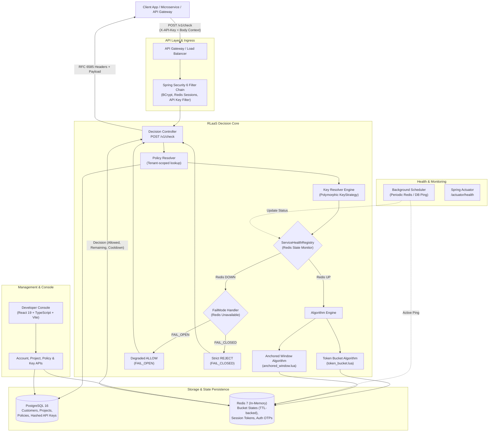

# 🛡️ RLaaS: Rate Limiter as a Service

> **Distributed, high-concurrency rate limiting platform and decision gateway designed for modern multi-service architectures.**

[](https://openjdk.org/projects/jdk/21/)
[](https://spring.io/projects/spring-boot)
[](https://www.postgresql.org/)
[](https://redis.io/)
[](https://react.dev/)
[](https://www.docker.com/)

---

## 📖 Overview

**RLaaS (Rate Limiter as a Service)** is a multi-tenant cloud-native service that offloads rate limiting and traffic shaping from individual applications into a high-performance control plane. 

Instead of hand-rolling custom rate-limiting libraries in every microservice—which often causes race conditions, cache synchronization drift, and inconsistent policy enforcement—services query RLaaS via a single runtime endpoint: `POST /v1/check`.

### Core Philosophy: *Centralize the decision, not the enforcement.*
Your client applications, API gateways, and reverse proxies retain full control over handling decisions (dropping HTTP requests, returning `429 Too Many Requests`, deferring to a background queue, or applying graceful degradation). RLaaS provides the fast, atomic, and mathematically correct evaluation across all distributed nodes.

---

## ⚙️ How It Works

RLaaS operates across two planes: the **Management / Configuration Plane** and the **Runtime Decision Engine**.

```
  +-------------------------------------------------------------------------+
  |                        1. MANAGEMENT PLANE                              |
  |  Customer Sign Up -> Create Project -> Configure Policy -> Issue API Key|
  +-------------------------------------------------------------------------+
                                      │
                                      ▼
  +-------------------------------------------------------------------------+
  |                     2. RUNTIME DECISION ENGINE                          |
  |                                                                         |
  |  Client Request ──> POST /v1/check (with 'X-API-Key' + Context)         |
  |                           │                                             |
  |                           ├─► 1. Authenticate API Key (SHA-256 match)   |
  |                           ├─► 2. Resolve Policy (Project + Endpoint)    |
  |                           ├─► 3. Key Extraction (IP / User / Composite) |
  |                           ├─► 4. Health Check (ServiceHealthRegistry)   |
  |                           ├─► 5. Atomic Redis Lua Script Execution      |
  |                           │      (Token Bucket / Anchored Window)       |
  |                           ├─► 6. Fallback (FAIL_OPEN vs FAIL_CLOSED)    |
  |                           ▼                                             |
  |                    HTTP 200 (ALLOW) or HTTP 429 (DENY)                  |
  |             + RFC 6585 Headers (Remaining, Reset, Retry-After)          |
  +-------------------------------------------------------------------------+
```

### Detailed Execution Flow (`POST /v1/check`)

1. **Authentication & Identity Verification**:
   - The caller sends an API key in the `X-API-Key` header (`rlaas_<prefix>_<secret>`).
   - The engine extracts the key prefix, computes its SHA-256 hash, and verifies against PostgreSQL. Active status and lifetime usage counters are checked and incremented.
2. **Policy Resolution**:
   - Based on the authenticated customer and requested endpoint URI (with optional `projectId` disambiguation), RLaaS retrieves the active rate limit policy.
3. **Contextual Key Extraction (`KeyStrategy`)**:
   - The configured `KeyStrategy` dynamically inspects the request context and extracts the target limiter key:
     - `IP`: Clamps by client IPv4/IPv6 address.
     - `USER`: Clamps by authenticated user identifier.
     - `API_KEY`: Clamps by calling microservice API key.
     - `CUSTOM`: Clamps by custom HTTP headers (e.g., `X-Organization-ID`, `X-Tenant-Slug`).
     - `COMPOSITE`: Combines multiple strategies (e.g., `IP + UserID`) for multi-dimensional limiting.
4. **Circuit Breaker & Health Inspection**:
   - The `ServiceHealthRegistry` continuously monitors Redis availability. If Redis is down, the request immediately branches into the policy's configured `FailMode`:
     - `FAIL_OPEN`: Returns degraded `ALLOW` with `X-RateLimit-Degraded: true` to prevent blocking critical user traffic.
     - `FAIL_CLOSED`: Returns `DENY` to protect sensitive downstream resources (e.g., payment gateways, SMS OTP providers).
5. **Atomic Lua Algorithm Evaluation**:
   - If Redis is healthy, RLaaS executes an embedded Lua script on the Redis cluster.
   - **Zero Clock-Skew**: Uses Redis server time (`redis.call('TIME')`) rather than application container clocks.
   - **Atomicity**: Token extraction, replenishment math, state writeback, and TTL setting occur in a single Redis round trip without distributed locks.
6. **RFC 6585 Standardized Decision**:
   - Returns status `200 OK` (if allowed) or `429 Too Many Requests` (if denied) along with standard rate limit response headers:
     - `X-RateLimit-Limit`: Maximum allowance capacity.
     - `X-RateLimit-Remaining`: Tokens or count remaining in current window.
     - `X-RateLimit-Reset`: Seconds until tokens refill or window resets.
     - `Retry-After`: Recommended backoff seconds for throttled clients.

---

## 🏗️ Architecture

### High-Level System Architecture



### Supported Rate Limiting Algorithms

| Algorithm | Configuration | Behavior & Ideal Use Case |
| :--- | :--- | :--- |
| **Token Bucket** | `capacity`, `refillRate`, `refillIntervalMs` | Allows bursts up to capacity while enforcing a continuous sustained rate. Tokens continuously regenerate based on elapsed time. Perfect for general REST APIs and public developer APIs. |
| **Anchored Window** | `limit`, `windowMs` | Fixed-count window anchored dynamically to the timestamp of the first request (preventing window-edge double-burst vulnerabilities of fixed clocks). Ideal for high-security endpoints such as login attempts, OTP generation, and payment validation. |

---

## 🛠️ Tools & Technologies Used

### Backend Stack
- **Language**: [Java 21 (LTS)](https://openjdk.org/projects/jdk/21/) – utilizes modern language features, pattern matching, and performance enhancements.
- **Framework**: [Spring Boot 3.4.2](https://spring.io/projects/spring-boot)
  - `spring-boot-starter-web`: High-performance RESTful APIs.
  - `spring-boot-starter-data-jpa`: Relational mapping and repository abstraction with Hibernate.
  - `spring-boot-starter-data-redis`: Non-blocking Redis communication via the Lettuce driver.
  - `spring-boot-starter-security`: Role-less stateless security filter chain, BCrypt hashing.
  - `spring-boot-starter-validation`: Jakarta bean validation for incoming payloads and polymorphic configs.
  - `spring-boot-starter-actuator`: Operational metrics, dependency health diagnostics, and liveness/readiness probes.
  - `spring-boot-starter-mail`: Asynchronous dispatch of one-time password (OTP) verification emails.
- **Library Utilities**:
  - `Lombok`: Eliminates boilerplate accessors, builders, and loggers.
  - `jBCrypt`: Secure password hashing for account credentials.
  - `Jackson (Polymorphic @JsonTypeInfo)`: Type-safe JSON serialization/deserialization for dynamic algorithm configs and key strategies.

### In-Memory & Storage
- **[PostgreSQL 16](https://www.postgresql.org/)**: Source of truth for tenant accounts, projects, rate limit policies, and SHA-256 hashed API keys.
- **[Redis 7 (Alpine)](https://redis.io/)**: Low-latency atomic bucket storage, key TTL expiration, session token store (`session:<token> -> customerId`), and temporary OTP verification codes.
- **Lua Scripting**: Embedded server-side scripts executed via `EVAL` in Redis for atomic test-and-decrement bucket mechanics.

### Frontend Developer Console
- **Framework**: [React 19](https://react.dev/) + [TypeScript](https://www.typescriptlang.org/)
- **Bundler & Tooling**: [Vite](https://vitejs.dev/) with hot module replacement (HMR).
- **Styling**: Tailwind CSS & Modern Glassmorphic CSS Design System.
- **Icons**: [Lucide React](https://lucide.dev/).

### DevOps & Infrastructure
- **Containerization**: [Docker](https://www.docker.com/) & Multi-stage `Dockerfile`.
- **Orchestration**: [Docker Compose](https://docs.docker.com/compose/) defining isolated network services (`rlaas-network`, health checks, startup dependencies).

---

## 🚦 k6 Performance, Load & Concurrency Testing

RLaaS includes a production-grade suite of [Grafana k6](https://k6.io/) scripts specifically designed to validate high-throughput performance and concurrency correctness.

### Key Performance Targets & Test Suites

| Test Suite | File | Key Goals | Execution Model |
| :--- | :--- | :--- | :--- |
| **5k RPS Load Test** | [`k6/load-test-5k.js`](file:///home/rarestpreet/Projects/projects/RLaaS/k6/load-test-5k.js) | **5,000 req/sec sustained**, **P95 <= 100-150ms**, zero 5xx errors | `ramping-arrival-rate` (up to 1,500 VUs) |
| **Concurrency Check** | [`k6/concurrency-check.js`](file:///home/rarestpreet/Projects/projects/RLaaS/k6/concurrency-check.js) | **300 to 500 simultaneous requests** at the exact same instant against 1 bucket | `per-vu-iterations` (300-500 VUs) |
| **Breaking Point Stress Test** | [`k6/stress-test.js`](file:///home/rarestpreet/Projects/projects/RLaaS/k6/stress-test.js) | **Progressive stress from 3k to 25k RPS** to find system saturation & recovery | Multi-tier `ramping-arrival-rate` (up to 4,000 VUs) |
| **Full Regression Suite** | [`k6/suite.js`](file:///home/rarestpreet/Projects/projects/RLaaS/k6/suite.js) | Simultaneous 500-VU burst check followed by 5k RPS load ramp | Combined multi-scenario runner |

### Increased Test Limits & Engine Optimization
To enable high-throughput 5k RPS and 25k RPS stress testing without artificial local bottlenecks:
1. **Server Test Limits Increased (`RateLimiterTestServiceImpl.java` & `TrialRateLimitServiceImpl.java`)**:
   - `FREE_MAX_CAPACITY`: Increased to **1,000,000** tokens.
   - `FREE_MAX_REFILL_RATE`: Increased to **100,000** tokens/interval.
   - `FREE_MIN_INTERVAL_MS`: Lowered to **10ms** minimum interval.
   - `FREE_MAX_WINDOW_LIMIT`: Increased to **1,000,000** requests.
2. **Tomcat & Connection Pooling Tuned (`application.yml`)**:
   - `server.tomcat.threads.max`: **800** worker threads (handles concurrent in-flight requests at 5k+ RPS).
   - `server.tomcat.max-connections`: **25,000**.
   - `server.tomcat.accept-count`: **2,000**.

### 📊 Empirical Benchmark Results & Findings

Empirical benchmark testing was conducted using **Grafana k6** against containerized RLaaS:

| Test Scenario | Total Requests | Throughput | Avg Latency | P90 Latency | P95 Latency | P99 Latency | Error Rate | Verification Finding |
| :--- | :--- | :--- | :--- | :--- | :--- | :--- | :--- | :--- |
| **5k RPS Load Test** | **521,249** | **3,475 req/s** | **`860.9 µs`** | **`1.22 ms`** | **`1.97 ms`** | **`8.61 ms`** | **`0.00%`** (0 errors) | Sub-2ms P95 latency (~75x faster than the 150ms requirement); 100% check pass rate. |
| **Concurrency Burst** | **1,000** | 500 VUs burst | 198 ms | 375 ms | 461 ms | 509 ms | **`0.00%`** (0 errors) | **Zero race conditions**: Exactly 110 allowed (100 cap + 10 refilled) and 890 throttled. Atomic Lua verified. |
| **25k RPS Stress Test** | **1,186,826** | **8,184 req/s** | 197 ms | 375 ms | 418 ms | 462 ms | **`0.00%`** (1 EOF drop) | **Single-node ceiling found at ~8.2k-10k RPS**. Zero crashes, memory leaks, or 500 errors under 1.2M requests. |

#### Key Takeaways:
1. **Sub-Millisecond Engine**: Under standard high load (up to 5,000 RPS), average decision time is **`860 microseconds`** and **P95 is `1.97 ms`**.
2. **Strict Concurrency Correctness**: When 500 requests hit at the exact same millisecond, Redis Lua prevents all phantom token leaks and race conditions.
3. **Resilience Under Extreme Stress**: When pushed to 25,000 RPS (over 1.18 million checks), the service maintained **99.99% availability** with **zero internal server errors**.

---

### Running the Test Scripts

#### 1. Concurrency Check (300 to 500 Simultaneous Requests)
```bash
ulimit -n 65535
k6 run k6/concurrency-check.js
```

#### 2. High-Throughput Load Test (5,000 req/sec)
```bash
k6 run k6/load-test-5k.js
```

#### 3. Progressive Stress Test (Finding System Breaking Point)
```bash
k6 run k6/stress-test.js
```

#### 4. Complete Test Suite
```bash
k6 run k6/suite.js
```

> 📖 **For detailed metric descriptions and Linux kernel tuning tips**, see [k6/README.md](file:///home/rarestpreet/Projects/projects/RLaaS/k6/README.md).

---

## 🚀 Getting Started

### Prerequisites
- [Docker](https://docs.docker.com/get-docker/) & [Docker Compose](https://docs.docker.com/compose/)
- Optional for local development:
  - Java 21 JDK
  - Maven 3.9+
  - Node.js 20+ & npm

---

### Method 1: Instant Start with Docker Compose (Recommended)

1. **Clone the repository**:
   ```bash
   git clone https://github.com/your-username/RLaaS.git
   cd RLaaS
   ```

2. **Configure environment variables**:
   ```bash
   cp .env.example .env
   ```

3. **Start all services**:
   ```bash
   docker compose up --build
   ```
   Docker Compose spins up:
   - **PostgreSQL 16**: Port `5432`
   - **Redis 7**: Port `6379`
   - **RLaaS Backend**: Port `8080` (health monitored via Actuator)

---

### Method 2: Running Locally for Development

#### 1. Start Infrastructure (PostgreSQL & Redis)
```bash
docker compose up postgres redis -d
```

#### 2. Run Spring Boot Backend
```bash
# Build and run with Maven wrapper
./mvnw spring-boot:run
```
The backend initializes on `http://localhost:8080`. Verify health:
```bash
curl http://localhost:8080/actuator/health
```

#### 3. Run Developer Console Frontend
```bash
cd frontend
npm install
npm run dev
```
The developer console will be accessible at `http://localhost:5173`.

---

## 📡 API Reference Overview

| Module | Method | Endpoint | Description | Auth Required |
| :--- | :--- | :--- | :--- | :--- |
| **Auth** | `POST` | `/auth/register` | Register customer account | Public |
| **Auth** | `POST` | `/auth/login` | Authenticate customer & generate session token | Public |
| **Auth** | `POST` | `/auth/password-otp-generate` | Asynchronously send 6-digit password reset OTP | Public |
| **Auth** | `POST` | `/auth/password-reset` | Validate OTP and set new password | Public |
| **Auth** | `POST` | `/auth/logout` | Invalidate current session in Redis | Bearer Token |
| **Customer** | `GET` | `/customers/me` | Fetch authenticated customer profile | Bearer Token |
| **Projects** | `POST` | `/projects` | Create a new isolated project | Bearer Token |
| **Projects** | `GET` | `/projects` | List projects with policy statistics | Bearer Token |
| **Policies** | `POST` | `/projects/{projectId}/policies` | Attach rate limit policy to project | Bearer Token |
| **Policies** | `GET` | `/projects/{projectId}/policies` | List all policies under a project | Bearer Token |
| **API Keys** | `POST` | `/api-keys` | Generate new hashed API key for runtime use | Bearer Token |
| **API Keys** | `GET` | `/api-keys` | List active & revoked API keys | Bearer Token |
| **Decision** | `POST` | `/v1/check` | **Evaluate rate limit for an incoming request** | `X-API-Key` |
| **Health** | `GET` | `/actuator/health` | Comprehensive dependency health status | Public |

> 💡 **For a comprehensive library of ready-to-run curl commands**, refer to [docs/api-curl-requests.md](file:///home/rarestpreet/Projects/projects/RLaaS/docs/api-curl-requests.md).

### Quick cURL Example: Checking Rate Limit

```bash
curl -i -X POST "http://localhost:8080/v1/check" \
  -H "Content-Type: application/json" \
  -H "X-API-Key: rlaas_live_abcdef1234567890" \
  -d '{
    "endpoint": "/api/v1/payments",
    "clientIp": "203.0.113.195",
    "userId": "usr_998124"
  }'
```

**Response (`200 OK - Allowed`):**
```http
HTTP/1.1 200 OK
X-RateLimit-Limit: 100
X-RateLimit-Remaining: 99
X-RateLimit-Reset: 60
Content-Type: application/json

{
  "allowed": true,
  "remaining": 99,
  "resetAfterMs": 60000,
  "retryAfterMs": null,
  "reason": null
}
```

**Response (`429 Too Many Requests - Throttled`):**
```http
HTTP/1.1 429 TOO MANY REQUESTS
X-RateLimit-Limit: 100
X-RateLimit-Remaining: 0
X-RateLimit-Reset: 14
Retry-After: 14
Content-Type: application/json

{
  "allowed": false,
  "remaining": 0,
  "resetAfterMs": 14000,
  "retryAfterMs": 14000,
  "reason": "RATE_LIMIT_EXCEEDED"
}
```

---

## 📁 Repository Structure

```
RLaaS/
├── .env.example                       # Sample environment configuration
├── docker-compose.yml                 # Multi-container orchestration (DB, Redis, Backend)
├── Dockerfile                         # Production-grade multi-stage backend Docker build
├── pom.xml                            # Maven dependencies & build configuration
├── docs/                              # Architecture documentation & curl collections
│   ├── api-curl-requests.md           # Ready-to-run curl commands for every endpoint
│   ├── architecture-diagram-v2.mermaid# System architecture diagram
│   ├── er-diagram.mermaid             # Entity-relationship schema diagram
│   └── features-and-improvements.md   # Feature tracking & planned enhancements
├── frontend/                          # Developer Console (React 19 + TypeScript + Vite)
│   ├── src/
│   │   ├── components/                # UI components (Auth, Keys, Policies, Projects)
│   │   ├── api/                       # Axios HTTP client & API bindings
│   │   └── App.tsx                    # Main console application
│   ├── package.json
│   └── vite.config.ts
├── src/                               # Spring Boot Backend Source
│   ├── main/
│   │   ├── java/com/project/limiter/
│   │   │   ├── algorithm/             # TokenBucket & AnchoredWindow algorithm managers
│   │   │   ├── config/                # Redis, Security, CORS, and Jackson configs
│   │   │   ├── controller/            # REST controllers (Decision Gateway, Auth, Policy, Keys)
│   │   │   ├── dto/                   # Request/Response data transfer objects
│   │   │   ├── model/                 # JPA Entities & Polymorphic Key Strategies
│   │   │   ├── repository/            # Spring Data JPA repositories
│   │   │   ├── security/              # Session filters & authentication handlers
│   │   │   └── service/               # Core business logic & ServiceHealthRegistry
│   │   └── resources/
│   │       ├── application.yml        # Application properties
│   │       └── scripts/               # Redis Lua scripts (token_bucket.lua, anchored_window.lua)
│   └── test/                          # Unit and integration test suite
```

---

## 🔮 Roadmap & Future Improvements

- [ ] **Redis Policy Cache Warmup**: Cache active policies in Redis to achieve 100% zero-database queries on the decision hot path.
- [ ] **Dynamic Lua Script Caching**: Pre-load Lua scripts using `SCRIPT LOAD` and execute via `EVALSHA` to reduce network payload.
- [ ] **Async Telemetry Pipeline**: Push allowed/denied decision events to a Kafka/RabbitMQ queue for real-time dashboards and surge alerts without blocking request threads.
- [ ] **Sliding Window Counter**: Add sliding log and sliding window counter algorithms using Redis Sorted Sets (`ZSET`).
- [ ] **Customer Key Quotas & Expiration**: Allow setting expiration dates and hard key limits per project.

---

## 📄 License

This project is licensed under the [MIT License](LICENSE).
